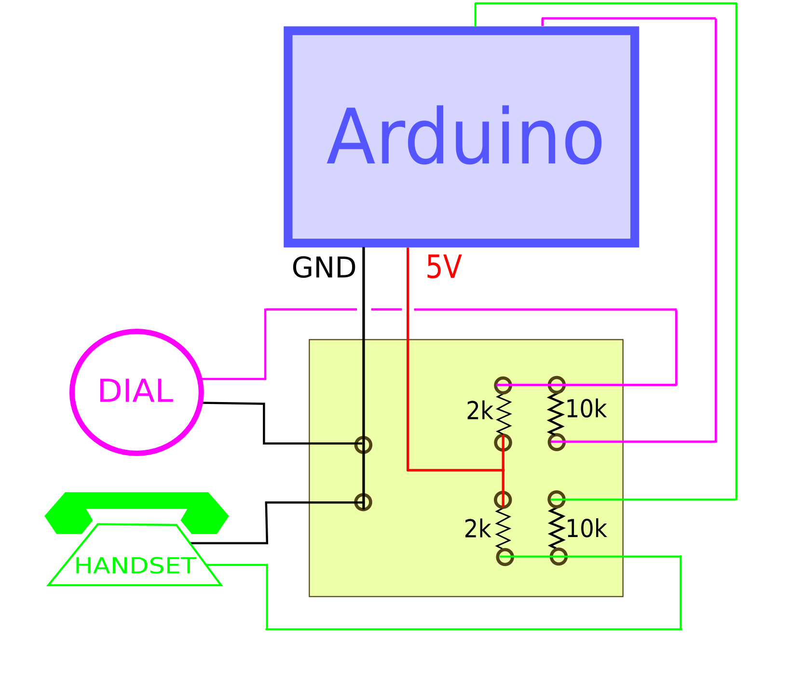

# RotoNixie

https://github.com/AntiqueSounds/RotoNixie

Nixie Rotary Phone Calculator
======

This Software runs a rudimentary 4 digit calculator that can add, subtract, multiply, or divide. 
The input device is a rotary telephone that is wired using a simple wire interface (pullup resistors) 
to the rotary selector and to the hook switch on the phone (flash switch is the same). 
There is a simple printed circuit board available to provide this interface. Contact the author if desired. 
The hardware required are: 
   - Arduino 
   - Arduinix Nixie shield -  https://www.tindie.com/stores/nixiekeith/ or www.arduinix.com/
   - Button interface (mentioned above)
   - Modified rotary phone 
   - Optional nixie header board for arduinix (also available from the author) 
   
The hook (phone cradle receive button called the "HOOK" or the "FLASH" button) is used for all state collection 
such as RESET, or SET CALCULATION (Add, Subtract, Multiply, Divide)
The software loops through an elementary state loop IDLE, SLEEP, ROTARY ENTRY, HOOK BUTTON ENTRY.

The Arduino Loop procedure checks for input and sets state and drives the calculation. Input is as follows:

Rotary
========
Phone Rotary - Enter digits left to right into the operands. 
1-4 digits can be selected, each selection from the rotary places the digit into the next rightmost decimal position.  
For each calculation, there are two operands. The hook button is used to enter the final commit into the operand register (first or second). See below.

Hook Button
========

There is one button used, the telephone cradle button which is called the "hook".  
This button is interpreted and drives state changes or rotary input for operands in calculation. 

The hook button - Hook is interpreted in three ways: short, medium, and long presses. 

  Short hook
  ------
  Short hook press = Press 1/2 to 1 second in duration. 
  Short press is the "select" function. If hook is pressed between 1/2 and 1 second it is interpreted as a short press. 
  Short press places the calculator into the next state (two states for the calculator)
  The first short press after a reset or mode setting will enter the value on the display into the first calculating register. 
  For example, if the rotary had previously entered 123 onto the nixie display, then 123 will go into the first value for the      calculation. 
  After a second value has been entered, a short HOOK press will enter the value 
  into the calculator and execute the calculation and display the result on the nixies.  

  Medium Hook
  -------
  Medium hook press = Press more than 1 second and less than 2 seconds. 
  Medium press is used to select the calculation functional mode (+, -, X, or /) . 
  Each medium press of the hook will rotate to the next calculation function:  ADD, then SUBTRACT, then MULTIPLY, then DIVIDE, then back to ADD, etc. 
  The nixie will show which calculation is requested by displaying on the COLON dots in the middle of the numbers.  
   - The initial value is ADD which is displayed as the NO dots displayed at all. Colon dots are off for an ADD function
   - Next selection is the SUBTRACT which is displayed using the lower dot on the colon (like a period character).
   - MULTIPLY follows the SUBTRACT and is displayed as the upper dot of the colon. Just the top dot is lit. 
   - The DIVIDE function is the last in rotation and is represented with both dots of the colon being lit. A full colon is lit. 
   - Subsequent medium press will roll back to an ADD function. And the loop starts again. 

  Long Hook
  -------
  Long hook press = More than 2 seconds.
  Long press is a RESET. A reset will put the calculator back to zero and into the add function.  

__________________________

Over and underflows result in zeros being displayed. 

This is a 4 digit calculator so only 0-9999 can be displayed and no negative values are displayed.  

There is logic for Sleep mode to protect the nixies from cathode poisoning. THe device goes into sleep mode after 60 seconds. 
The sleep code is buggy and has not yet been refined. If the code goes into sleep mode, 
the nixie display will shut off and the devices will show a pulsing LED back-light. 
If it works properly, the device is awaken with a hook press of any length. If all else fails use the LONG hook press (RESET). 
________________________________

Interface:

